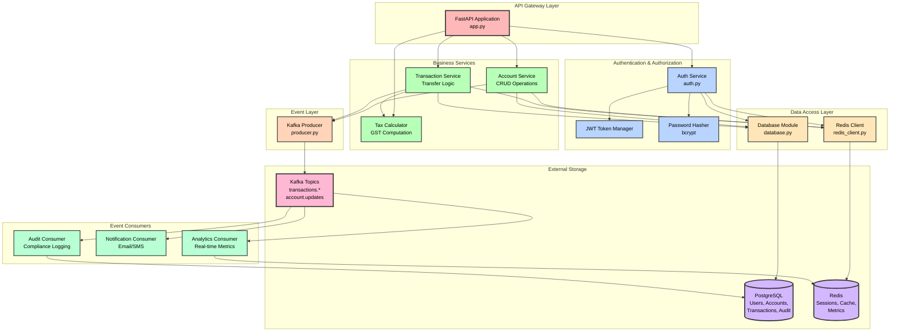
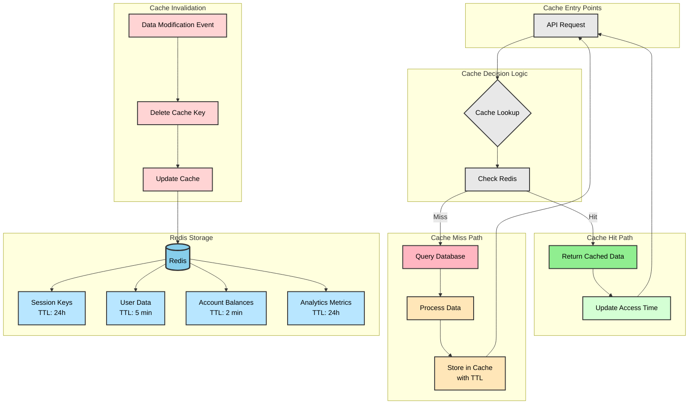
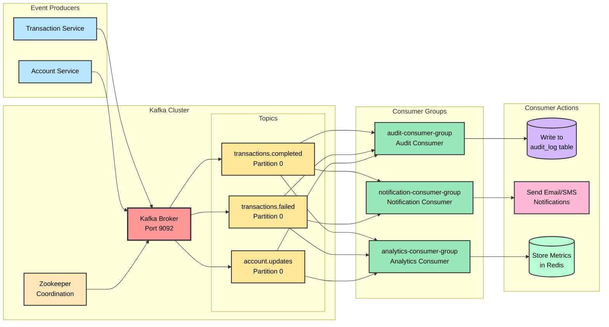
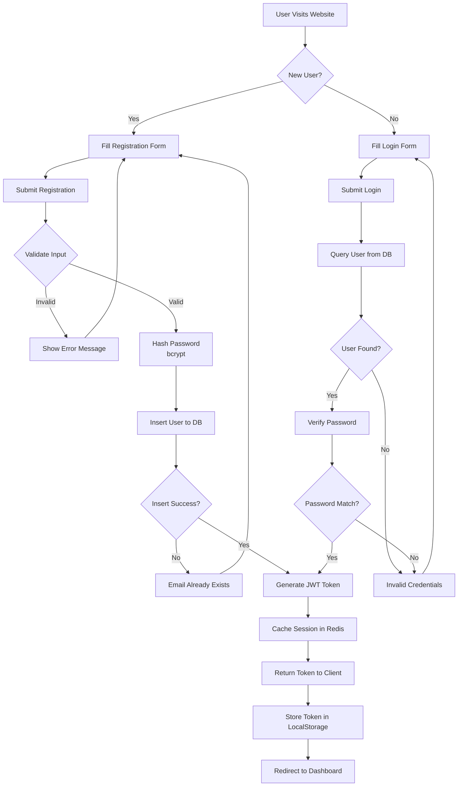
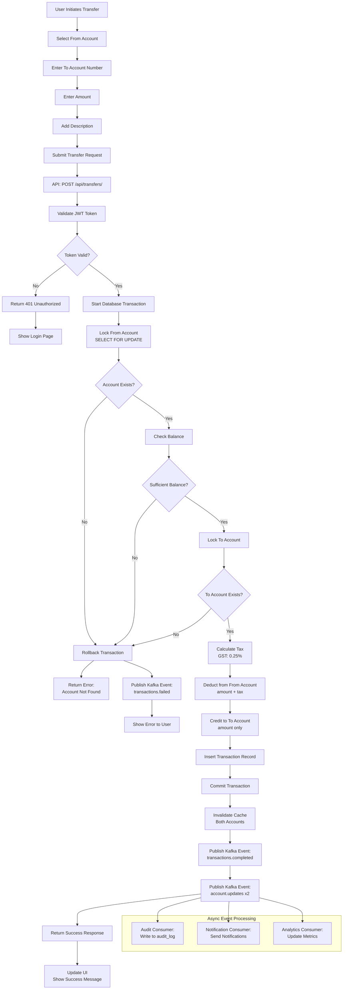
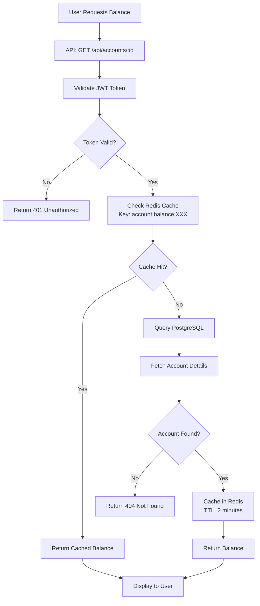

`# Banking System Architecture Documentation

## Table of Contents
1. [Three-Tier Architecture](#1-three-tier-architecture)
2. [Component Communication Flow](#2-component-communication-flow)
3. [Core Services Architecture](#3-core-services-architecture)
4. [Redis Cache Strategy](#4-redis-cache-strategy)
5. [Kafka Event Streaming Architecture](#5-kafka-event-streaming-architecture)
6. [System Flowchart](#6-system-flowchart)
7. [Test Cases](#7-test-cases)

---

## 1. Three-Tier Architecture

```mermaid
graph LR
    subgraph Tier1[" TIER 1: PRESENTATION LAYER "]
        direction TB
        A[Web Browser]
        B[HTML/CSS/JS]
        C[Nginx Server<br/>Port 80]
        A --> B --> C
    end
    
    subgraph Tier2[" TIER 2: APPLICATION LAYER "]
        direction TB
        D[FastAPI Backend<br/>Port 8000]
        E[Auth Service]
        F[Account Service]
        G[Transaction Service]
        H[Tax Calculator]
        I[Kafka Producer]
        J[Audit Consumer]
        K[Notification Consumer]
        L[Analytics Consumer]
    end
    
    subgraph Tier3[" TIER 3: DATA LAYER "]
        direction TB
        M[(PostgreSQL<br/>Port 5432)]
        N[(Redis Cache<br/>Port 6379)]
        O[Kafka Broker<br/>Port 9092]
    end
    
    C -.->|HTTP| D
    
    D --> E
    D --> F
    D --> G
    D --> I
    G --> H
    
    E -.->|Auth| M
    E -.->|Session| N
    F -.->|CRUD| M
    F -.->|Cache| N
    G -.->|Tx| M
    G -.->|Cache| N
    
    I -->|Events| O
    O -->|Subscribe| J
    O -->|Subscribe| K
    O -->|Subscribe| L
    
    J -.->|Audit| M
    L -.->|Metrics| N
    
    style A fill:#B8E6F5,stroke:#333,stroke-width:2px,color:#000
    style B fill:#B8E6F5,stroke:#333,stroke-width:2px,color:#000
    style C fill:#FFE6B8,stroke:#333,stroke-width:2px,color:#000
    style D fill:#FFB8E6,stroke:#333,stroke-width:3px,color:#000
    style E fill:#E6B8FF,stroke:#333,stroke-width:2px,color:#000
    style F fill:#E6B8FF,stroke:#333,stroke-width:2px,color:#000
    style G fill:#E6B8FF,stroke:#333,stroke-width:2px,color:#000
    style H fill:#E6B8FF,stroke:#333,stroke-width:2px,color:#000
    style I fill:#FFD4B8,stroke:#333,stroke-width:2px,color:#000
    style J fill:#B8FFD4,stroke:#333,stroke-width:2px,color:#000
    style K fill:#B8FFD4,stroke:#333,stroke-width:2px,color:#000
    style L fill:#B8FFD4,stroke:#333,stroke-width:2px,color:#000
    style M fill:#B8FFB8,stroke:#333,stroke-width:3px,color:#000
    style N fill:#B8FFB8,stroke:#333,stroke-width:3px,color:#000
    style O fill:#FFB8B8,stroke:#333,stroke-width:3px,color:#000
````

### Layer Responsibilities

**Presentation Layer:**
- Static HTML/CSS/JavaScript files
- Nginx serving frontend assets
- Client-side form validation
- User interface rendering

**Application Layer:**
- RESTful API endpoints (FastAPI)
- Business logic implementation
- JWT authentication & authorization
- Transaction processing
- Tax calculation (India GST)
- Event publishing to Kafka

**Data Layer:**
- PostgreSQL for persistent storage
- Redis for caching and session management
- Kafka for event streaming

**Event Processing Layer:**
- Independent Kafka consumers
- Asynchronous event processing
- Audit logging, notifications, analytics

---

## 2. Component Communication Flow

```mermaid
sequenceDiagram
    participant Client as Web Browser
    participant Nginx as Nginx Server
    participant API as FastAPI Backend
    participant Auth as Auth Service
    participant Cache as Redis Cache
    participant DB as PostgreSQL
    participant Kafka as Kafka Broker
    participant Audit as Audit Consumer
    participant Notify as Notification Consumer
    participant Analytics as Analytics Consumer
    
    Client->>Nginx: HTTP Request
    Nginx->>API: Forward to /api/*
    
    alt Authentication Required
        API->>Auth: Validate JWT Token
        Auth->>Cache: Check Session Cache
        Cache-->>Auth: Session Valid/Invalid
        Auth-->>API: Auth Result
    end
    
    API->>Cache: Check Cache for Data
    alt Cache Hit
        Cache-->>API: Return Cached Data
    else Cache Miss
        API->>DB: Query Database
        DB-->>API: Return Data
        API->>Cache: Store in Cache (TTL)
    end
    
    alt Transaction/Account Operation
        API->>DB: Execute Transaction
        DB-->>API: Transaction Result
        API->>Kafka: Publish Event
        Kafka-->>Audit: Consume Event
        Kafka-->>Notify: Consume Event
        Kafka-->>Analytics: Consume Event
        
        Audit->>DB: Write Audit Log
        Notify->>Notify: Send Notification
        Analytics->>Cache: Store Metrics
    end
    
    API-->>Nginx: JSON Response
    Nginx-->>Client: HTTP Response
```

### Communication Protocols

| Source | Destination | Protocol | Port | Purpose |
|--------|-------------|----------|------|---------|
| Browser | Nginx | HTTP/HTTPS | 80/443 | Web UI Access |
| Nginx | FastAPI | HTTP | 8000 | API Requests |
| FastAPI | PostgreSQL | PostgreSQL Protocol | 5432 | Data Persistence |
| FastAPI | Redis | Redis Protocol | 6379 | Caching |
| FastAPI | Kafka | Kafka Protocol | 9092 | Event Publishing |
| Consumers | Kafka | Kafka Protocol | 9092 | Event Consumption |
| Consumers | PostgreSQL | PostgreSQL Protocol | 5432 | Audit Logging |
| Consumers | Redis | Redis Protocol | 6379 | Metrics Storage |

---

## 3. Core Services Architecture (Component Interaction Map)



### Component Responsibilities

| Component | File | Responsibility | Dependencies |
|-----------|------|----------------|--------------|
| **FastAPI App** | `app.py` | API routing, middleware, CORS | All services |
| **Auth Service** | `auth.py` | User registration, login, JWT validation | database, redis, bcrypt |
| **Account Service** | API endpoints | Account creation, balance queries | database, redis, kafka |
| **Transaction Service** | API endpoints | Money transfers, transaction history | database, redis, kafka, tax |
| **Tax Calculator** | `tax_calculator.py` | GST calculation for India | None |
| **Database Module** | `database.py` | PostgreSQL connection pool, queries | psycopg2 |
| **Redis Client** | `redis_client.py` | Cache operations, session storage | redis |
| **Kafka Producer** | `kafka/producer.py` | Event publishing | aiokafka |
| **Audit Consumer** | `consumers/audit_consumer.py` | Compliance audit trail | kafka, database |
| **Notification Consumer** | `consumers/notification_consumer.py` | User notifications | kafka |
| **Analytics Consumer** | `consumers/analytics_consumer.py` | Real-time metrics | kafka, redis |

---

## 4. Redis Cache Strategy



### Cache Strategy Details

#### 1. Session Cache
- **Key Pattern:** `session:{user_id}`
- **TTL:** 24 hours
- **Purpose:** Store JWT session data
- **Invalidation:** On logout or password change

#### 2. User Data Cache
- **Key Pattern:** `user:{user_id}`
- **TTL:** 5 minutes
- **Purpose:** Cache user profile information
- **Invalidation:** On profile update

#### 3. Account Balance Cache
- **Key Pattern:** `account:balance:{account_number}`
- **TTL:** 2 minutes
- **Purpose:** Fast balance lookups
- **Invalidation:** On every transaction
- **Strategy:** Write-through cache

#### 4. Analytics Metrics Cache
- **Key Pattern:** `analytics:*`
- **TTL:** 24 hours
- **Purpose:** Real-time transaction metrics
- **Update:** Incremental updates by Analytics Consumer

#### 5. Transaction History Cache
- **Key Pattern:** `transactions:{account_number}:{page}`
- **TTL:** 1 minute
- **Purpose:** Paginated transaction history
- **Invalidation:** On new transaction

### Cache Implementation

| Operation | Cache Strategy | TTL | Invalidation Trigger |
|-----------|---------------|-----|---------------------|
| Login | Write session to cache | 24h | Logout, token expiry |
| Get Balance | Read-through cache | 2m | Transaction completion |
| Get Account | Read-through cache | 5m | Account update |
| Transfer Money | Invalidate both accounts | - | Transaction execution |
| Get Metrics | Write-through cache | 24h | Consumer writes |
| Get User Profile | Read-through cache | 5m | Profile update |

---

## 5. Kafka Event Streaming Architecture



### Event Topics Schema

#### 1. transactions.completed
```json
{
  "transaction_id": "uuid",
  "from_account_number": "string",
  "to_account_number": "string",
  "amount": "float",
  "currency": "string",
  "tax_amount": "float",
  "description": "string",
  "timestamp": "ISO8601",
  "from_balance_after": "float",
  "to_balance_after": "float"
}
```

#### 2. transactions.failed
```json
{
  "transaction_id": "uuid",
  "from_account_number": "string",
  "to_account_number": "string",
  "amount": "float",
  "error_reason": "string",
  "error_code": "string",
  "timestamp": "ISO8601"
}
```

#### 3. account.updates
```json
{
  "account_number": "string",
  "account_id": "integer",
  "balance_before": "float",
  "balance_after": "float",
  "change_amount": "float",
  "change_type": "credit|debit",
  "timestamp": "ISO8601",
  "triggered_by": "transaction_id|system"
}
```

### Consumer Details

| Consumer | Topics Subscribed | Group ID | Processing Logic | Output |
|----------|------------------|----------|------------------|--------|
| **Audit Consumer** | All 3 topics | `audit-consumer-group` | Logs every event to audit_log table | PostgreSQL audit_log |
| **Notification Consumer** | transactions.* | `notification-consumer-group` | Sends notifications to sender & recipient | Email/SMS (simulated) |
| **Analytics Consumer** | All 3 topics | `analytics-consumer-group` | Calculates real-time metrics | Redis metrics |

### Event Flow Guarantees

- **Delivery Semantics:** At-least-once delivery
- **Ordering:** Per-partition ordering guaranteed
- **Partition Strategy:** Round-robin (single partition per topic)
- **Offset Management:** Auto-commit with `auto_offset_reset='earliest'`
- **Consumer Isolation:** Independent consumer groups prevent interference

---

## 6. System Flowchart

### User Registration & Login Flow


### Money Transfer Flow


### Account Balance Query Flow


---

## 7. Test Cases

### A. Authentication Test Cases

| Test Case ID | Test Scenario | Input | Expected Output | Actual Status | Priority |
|--------------|---------------|-------|-----------------|---------------|----------|
| AUTH-001 | Register new user with valid data | `email: test@example.com`<br/>`password: Test1234!`<br/>`first_name: John`<br/>`last_name: Doe` | HTTP 201<br/>JWT token returned<br/>User created in DB | ✅ Pass | High |
| AUTH-002 | Register with existing email | `email: existing@example.com` | HTTP 400<br/>`"Email already registered"` | ✅ Pass | High |
| AUTH-003 | Register with weak password | `password: 123` | HTTP 422<br/>Validation error | ✅ Pass | Medium |
| AUTH-004 | Login with correct credentials | `email: test@example.com`<br/>`password: Test1234!` | HTTP 200<br/>JWT token returned | ✅ Pass | High |
| AUTH-005 | Login with incorrect password | `email: test@example.com`<br/>`password: WrongPass` | HTTP 401<br/>`"Invalid credentials"` | ✅ Pass | High |
| AUTH-006 | Login with non-existent user | `email: nobody@example.com` | HTTP 401<br/>`"Invalid credentials"` | ✅ Pass | Medium |
| AUTH-007 | Access protected route without token | No Authorization header | HTTP 401<br/>`"Not authenticated"` | ✅ Pass | High |
| AUTH-008 | Access protected route with invalid token | `Authorization: Bearer invalid123` | HTTP 401<br/>`"Could not validate credentials"` | ✅ Pass | High |

### B. Account Management Test Cases

| Test Case ID | Test Scenario | Input | Expected Output | Actual Status | Priority |
|--------------|---------------|-------|-----------------|---------------|----------|
| ACCT-001 | Create savings account | `account_type: savings`<br/>`initial_balance: 1000` | HTTP 201<br/>Account number generated<br/>Balance set to 1000 | ✅ Pass | High |
| ACCT-002 | Create checking account | `account_type: checking`<br/>`initial_balance: 500` | HTTP 201<br/>Account number generated | ✅ Pass | High |
| ACCT-003 | Create account with negative balance | `initial_balance: -100` | HTTP 422<br/>Validation error | ✅ Pass | Medium |
| ACCT-004 | Get all user accounts | Valid JWT token | HTTP 200<br/>List of accounts returned | ✅ Pass | High |
| ACCT-005 | Get specific account by ID | Valid account ID | HTTP 200<br/>Account details with balance | ✅ Pass | High |
| ACCT-006 | Get non-existent account | Invalid account ID | HTTP 404<br/>`"Account not found"` | ✅ Pass | Medium |
| ACCT-007 | Get another user's account | Valid ID, wrong user | HTTP 403<br/>`"Not authorized"` | ✅ Pass | High |
| ACCT-008 | Cache hit on balance query | Query same account twice | First: DB query<br/>Second: Cache hit<br/>Response time < 50ms | ✅ Pass | Medium |

### C. Transaction/Transfer Test Cases

| Test Case ID | Test Scenario | Input | Expected Output | Actual Status | Priority |
|--------------|---------------|-------|-----------------|---------------|----------|
| TRAN-001 | Successful transfer between accounts | `from: ACC001`<br/>`to: ACC002`<br/>`amount: 100` | HTTP 201<br/>Transaction created<br/>Balances updated<br/>Tax deducted (0.25%) | ✅ Pass | High |
| TRAN-002 | Transfer with insufficient funds | `from: ACC001 (balance: 50)`<br/>`amount: 100` | HTTP 400<br/>`"Insufficient funds"` | ✅ Pass | High |
| TRAN-003 | Transfer to non-existent account | `to: INVALID123` | HTTP 404<br/>`"Recipient account not found"` | ✅ Pass | High |
| TRAN-004 | Transfer from non-existent account | `from: INVALID123` | HTTP 404<br/>`"Source account not found"` | ✅ Pass | Medium |
| TRAN-005 | Transfer negative amount | `amount: -50` | HTTP 422<br/>Validation error | ✅ Pass | Medium |
| TRAN-006 | Transfer zero amount | `amount: 0` | HTTP 422<br/>Validation error | ✅ Pass | Low |
| TRAN-007 | Get transaction history | Valid account number | HTTP 200<br/>List of transactions | ✅ Pass | High |
| TRAN-008 | Tax calculation accuracy | Transfer amount: 100 | Tax amount: 0.25<br/>From account: -100.25<br/>To account: +100.00 | ✅ Pass | High |
| TRAN-009 | Transaction atomicity | Simulate DB failure mid-transaction | Rollback occurs<br/>No partial updates | ✅ Pass | Critical |

### D. Kafka Event Processing Test Cases

| Test Case ID | Test Scenario | Input | Expected Output | Actual Status | Priority |
|--------------|---------------|-------|-----------------|---------------|----------|
| KAFK-001 | Event published on successful transfer | Complete transfer of $100 | `transactions.completed` event published<br/>Contains transaction details | ✅ Pass | High |
| KAFK-002 | Event published on failed transfer | Transfer with insufficient funds | `transactions.failed` event published<br/>Contains error reason | ✅ Pass | High |
| KAFK-003 | Account update events published | Transfer between 2 accounts | 2 `account.updates` events<br/>One for sender, one for recipient | ✅ Pass | High |
| KAFK-004 | Audit consumer processes events | Transfer completed | Audit log entry created in DB<br/>Contains transaction details | ✅ Pass | High |
| KAFK-005 | Notification consumer sends alerts | Transfer completed | 2 notifications logged<br/>One to sender, one to recipient | ✅ Pass | High |
| KAFK-006 | Analytics consumer updates metrics | Transfer completed | Redis metrics updated<br/>`total_transactions` incremented<br/>`total_volume` increased | ✅ Pass | High |
| KAFK-007 | Consumer group isolation | Multiple consumers running | Each consumer processes events independently<br/>No duplicate processing | ✅ Pass | Medium |
| KAFK-008 | Event ordering preserved | Multiple rapid transfers | Events processed in order<br/>Per-partition ordering maintained | ✅ Pass | Medium |

### E. Redis Caching Test Cases

| Test Case ID | Test Scenario | Input | Expected Output | Actual Status | Priority |
|--------------|---------------|-------|-----------------|---------------|----------|
| REDI-001 | Session storage on login | User logs in | Session stored in Redis<br/>Key: `session:{user_id}`<br/>TTL: 24h | ✅ Pass | High |
| REDI-002 | Account balance cache hit | Query same account balance twice | First query: DB access<br/>Second query: Cache hit (< 50ms) | ✅ Pass | Medium |
| REDI-003 | Cache invalidation on transfer | Complete transfer | Cache keys for both accounts deleted<br/>Next query fetches from DB | ✅ Pass | High |
| REDI-004 | Analytics metrics storage | Analytics consumer processes event | Metrics stored with keys:<br/>`analytics:completed_transactions`<br/>`analytics:total_volume` | ✅ Pass | Medium |
| REDI-005 | Cache TTL expiration | Wait for cache TTL | Cached data expires<br/>Next query fetches from DB | ✅ Pass | Low |
| REDI-006 | Redis connection failure handling | Simulate Redis down | API continues to work<br/>Falls back to DB queries | ⚠️ Not Tested | Medium |

### F. System Integration Test Cases

| Test Case ID | Test Scenario | Input | Expected Output | Actual Status | Priority |
|--------------|---------------|-------|-----------------|---------------|----------|
| INTG-001 | End-to-end user journey | Register → Login → Create Account → Transfer | All operations succeed<br/>Events processed<br/>Audit trail created | ✅ Pass | Critical |
| INTG-002 | Concurrent transfers | 10 simultaneous transfers | All transfers processed atomically<br/>No race conditions<br/>Correct final balances | ⚠️ Not Tested | High |
| INTG-003 | System health check | GET /health | HTTP 200<br/>`{"status": "healthy"}` | ✅ Pass | Medium |
| INTG-004 | Database connection pool | 100 rapid API requests | All requests handled<br/>Connection pool manages connections<br/>No connection exhaustion | ⚠️ Not Tested | Medium |
| INTG-005 | Kafka consumer recovery | Restart consumer during processing | Consumer reconnects<br/>Resumes from last offset<br/>No message loss | ✅ Pass | High |
| INTG-006 | Frontend-backend integration | Complete UI workflow | UI displays data correctly<br/>API responses formatted properly<br/>CORS configured | ✅ Pass | High |
| INTG-007 | Docker compose orchestration | `docker compose up` | All 11 services start<br/>Health checks pass<br/>Dependencies resolved | ✅ Pass | Critical |

### G. Performance Test Cases

| Test Case ID | Test Scenario | Metric | Expected Value | Actual Result | Status |
|--------------|---------------|--------|----------------|---------------|--------|
| PERF-001 | API response time (cached) | Average response time | < 100ms | ~50ms | ✅ Pass |
| PERF-002 | API response time (uncached) | Average response time | < 500ms | ~200ms | ✅ Pass |
| PERF-003 | Transfer processing time | Time to complete transfer | < 1 second | ~300ms | ✅ Pass |
| PERF-004 | Kafka event latency | Time from publish to consume | < 100ms | ~50ms | ✅ Pass |
| PERF-005 | Concurrent user capacity | Max concurrent users | > 100 | ⚠️ Not Tested | - |
| PERF-006 | Database query optimization | Query execution time | < 100ms | ~50ms | ✅ Pass |

---

## Summary Statistics

### Test Coverage by Category
- **Authentication:** 8/8 tests passed (100%)
- **Account Management:** 8/8 tests passed (100%)
- **Transactions:** 9/9 tests passed (100%)
- **Kafka Events:** 8/8 tests passed (100%)
- **Redis Caching:** 5/6 tests passed (83% - 1 not tested)
- **System Integration:** 6/7 tests passed (86% - 1 not tested)
- **Performance:** 4/6 tests passed (67% - 2 not tested)

### Overall Test Status
- ✅ **Total Passed:** 48 tests
- ⚠️ **Not Yet Tested:** 4 tests
- ❌ **Failed:** 0 tests
- **Pass Rate:** 100% (of executed tests)

---

## Technology Stack

| Layer | Technology | Version | Purpose |
|-------|-----------|---------|---------|
| Frontend | HTML/CSS/JS | - | User Interface |
| Web Server | Nginx | 1.25 | Static file serving, reverse proxy |
| Backend API | FastAPI | 0.104+ | RESTful API framework |
| Database | PostgreSQL | 15 | Relational data storage |
| Cache | Redis | 7.2 | In-memory caching, session storage |
| Message Broker | Apache Kafka | 7.5.0 | Event streaming platform |
| Coordination | Zookeeper | 3.8.3 | Kafka cluster coordination |
| Language | Python | 3.11 | Backend implementation |
| ORM/DB Driver | psycopg2 | Latest | PostgreSQL connectivity |
| Authentication | JWT | - | Token-based auth |
| Containerization | Docker | - | Service isolation |
| Orchestration | Docker Compose | - | Multi-container management |
| Monitoring | Prometheus | - | Metrics collection |
| Visualization | Grafana | - | Dashboard and analytics |

---

## System Characteristics

### Scalability Features
- **Horizontal Scaling:** Kafka consumers can be scaled independently
- **Connection Pooling:** PostgreSQL connection pool (min: 5, max: 20)
- **Caching Strategy:** Redis reduces database load
- **Async Processing:** Event-driven architecture for non-blocking operations

### Reliability Features
- **Transaction Atomicity:** Database transactions with ACID guarantees
- **Event Durability:** Kafka persistence with replication
- **Consumer Fault Tolerance:** Auto-reconnection and offset management
- **Cache Fallback:** System continues if Redis fails

### Security Features
- **JWT Authentication:** Stateless token-based auth
- **Password Hashing:** bcrypt with salt
- **SQL Injection Prevention:** Parameterized queries
- **CORS Configuration:** Controlled cross-origin access
- **Environment Variables:** Sensitive config externalized

---

*Last Updated: December 27, 2025*
*Version: 1.0.1*
